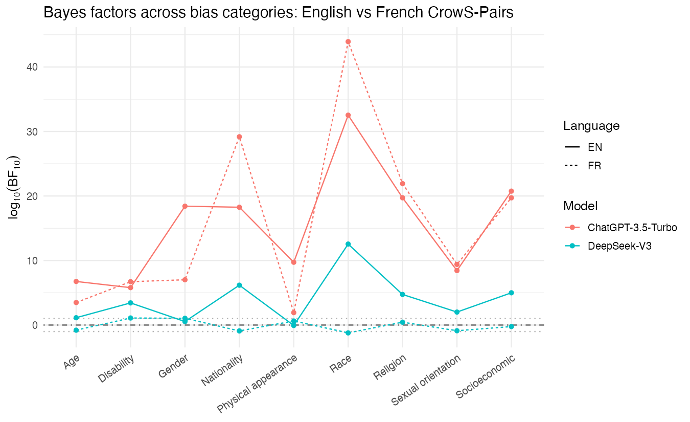

# LLM-Bias: Bayesian hypothesis testing for LLM bias detection

An R implementation that reproduces Si, Jiang, Su & Carin (2025), "Detecting
implicit biases of large language models with Bayesian hypothesis testing".

## The idea

The paper turns bias detection into a hypothesis test. For each bias category
(age, gender, race, and so on), a model answers `n` paired questions built so
one answer is the "stereotypical" choice; `k` counts how often it picks that
one. Modeling `k` as Binomial(n, π), the test pits **H₀: π = 0.5** (no bias)
against **H₁: π ≠ 0.5** (the model favors one answer), using two tools: an
exact binomial test (a p-value), and a Bayes factor, BF₁₀ = Beta(k+1, n−k+1) /
0.5ⁿ, under a uniform prior on π. The Bayes factor's edge over the p-value is
that it can quantify evidence for the no-bias hypothesis too, not just fail to
reject it.

## Scope

| | |
|---|---|
| **Models** | ChatGPT-3.5-Turbo, DeepSeek-V3 |
| **Datasets** | CrowS-Pairs (EN & FR), BBQ, Winogender, full data, all nine bias categories |
| **Experiments** | Table 3 (CrowS-EN) · Fig 2 (EN vs FR) · Table 4 (BBQ) · Table 5 + Fig 3 (temperature × sample size) · Table 6 (gender across datasets) |

## Layout

```
paper/                 the original paper (PDF)                      → paper/28.BiasLLM.pdf

data/                  input datasets + response cache + result CSVs → data/README.md
  crows_pairs/         CrowS-Pairs EN & FR — stereotypical vs anti-stereotypical sentence pairs
  bbq/                 BBQ — ambiguous-context, negative-polarity multiple-choice bias questions
  winogender/          Winogender — coreference sentences (male / female / neutral pronoun)
  cache/               append-only cache of raw model responses, one .jsonl per dataset×model×temp
  results/             per-experiment metrics + our-vs-paper compare_*.csv

src/                   the R implementation                          → src/README.md
  main.R               single entry point: Rscript src/main.R <tests|A|B|C|D|E|all>
  load_all.R           sources the whole library
  R/                   the 7-module library
    config.R           paths, models, prompts, categories, .env keys
    stats.R            SS / exact binomial test / Bayes factor (BF10)
    parse.R            0/1 and ans0/1/2 response parsing (-> NA if unparseable)
    datasets.R         CrowS + BBQ (+ group resolver) + Winogender loaders
    collect.R          API client + append-only cache + run_dataset
    analysis.R         aggregate -> metrics + paper reference values + comparison
    report.R           CSV/markdown table builders + Fig 2 & Fig 3
  experiments/         one script per experiment
    run_A_crows_en.R     Table 3 (CrowS-EN)
    run_B_crows_fr.R     Fig 2 (EN vs FR)
    run_C_bbq.R          Table 4 (BBQ)
    run_D_temperature.R  Table 5 + Fig 3 (temperature × sample-size grid)
    run_E_gender.R       Table 6 (gender across datasets)
    run_all.R            runs A–E in sequence
    helpers.R            shared experiment helpers
  tests/               offline testthat suite (no API calls, no cost)
    run_tests.R          test runner
    testthat/            test-stats.R, test-parse.R, test-data-counts.R, test-bbq-resolver.R

outputs/               generated figures and tables                  → outputs/README.md
  tables/              markdown tables (Table 3–5 per model)
  figures/             fig2_crosslanguage.png, fig3_temperature.png

presentation/          the slide deck: LLM Bias Deck.pdf
```

## Results

All five experiments ran against live models, ChatGPT-3.5-Turbo and
DeepSeek-V3, across CrowS-Pairs (English and French), BBQ, and Winogender, all
nine of the paper's bias categories, no subsampling.

Both models still show measurable stereotyping, but the details shifted since
the paper's 2024 snapshot, and they shifted in opposite directions. ChatGPT is
now more stereotypical, while DeepSeek is now less stereotypical.



*Log₁₀ Bayes factor per bias category, English vs French: ChatGPT's stereotyping holds in both languages, DeepSeek's mostly vanishes in French.*

Concretely: on English CrowS-Pairs, ChatGPT is now significantly stereotypical in
all 9/9 categories (SS 0.76–0.93, e.g. Religion SS=0.93, log₁₀BF=19.7 — up from the
paper's SS ≈0.53–0.72), while DeepSeek is significant in 8/9 (SS 0.58–0.77, down
from the paper's 0.86–0.96) and its bias mostly evaporates in French — e.g. Race
log₁₀BF drops from +12.6 in English to −1.2 in French, flipping the evidence to
favor no bias. On gender specifically (Table 6), ChatGPT is significantly biased
across all three benchmarks (rate 0.60–0.76), while DeepSeek shows no significant
gender bias at all on Winogender (rate 0.45, log₁₀BF −0.57, evidence for H₀).

## Getting started

Run from the project root:

```
Rscript src/main.R tests        # offline correctness suite — no API, no cost
Rscript src/main.R              # print usage
Rscript src/main.R all          # reproduce every experiment (cached + resumable)
```

Requirements, `.env` API-key setup, and the code layout are in
**[`src/README.md`](src/README.md)**.
